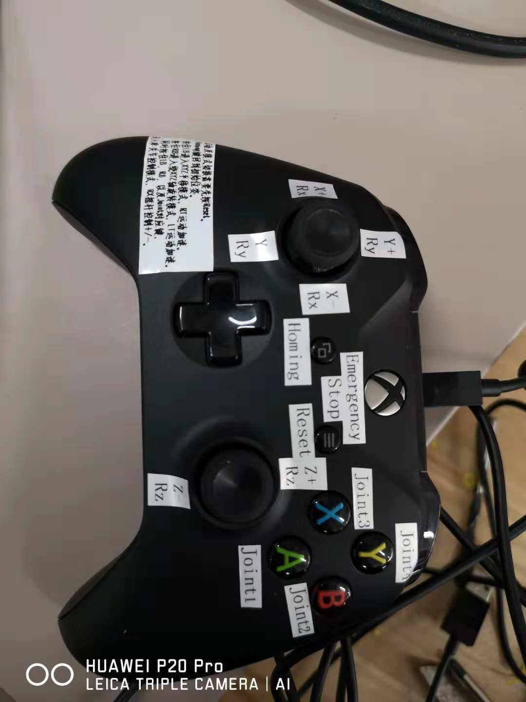

# 7_dof_robot_arm
7 Dof Robot Arm for Gazebo Simulation
## Build
`catkin_make`
## Launch Gazebo and Rviz
~~~
roslaunch arm_hand arm_hand_empty_world.launch
~~~
publish Sensor_msgs/Jointstates name "/joint_command" to control position of 7 joints
## Using joy controller
If you have a xbox360 joy,  like this  
 then launch
`roslaunch visual_servo_test joy_control.launch`
## Move to a Given target Pose
There *test.cpp* provide a node to publish **TF transform** from Target Frame to End Effector(link7), the servo_contorl_node listen to the transform, and move when a active command send by joy.

`rosrun visual_servo_test test_node`
